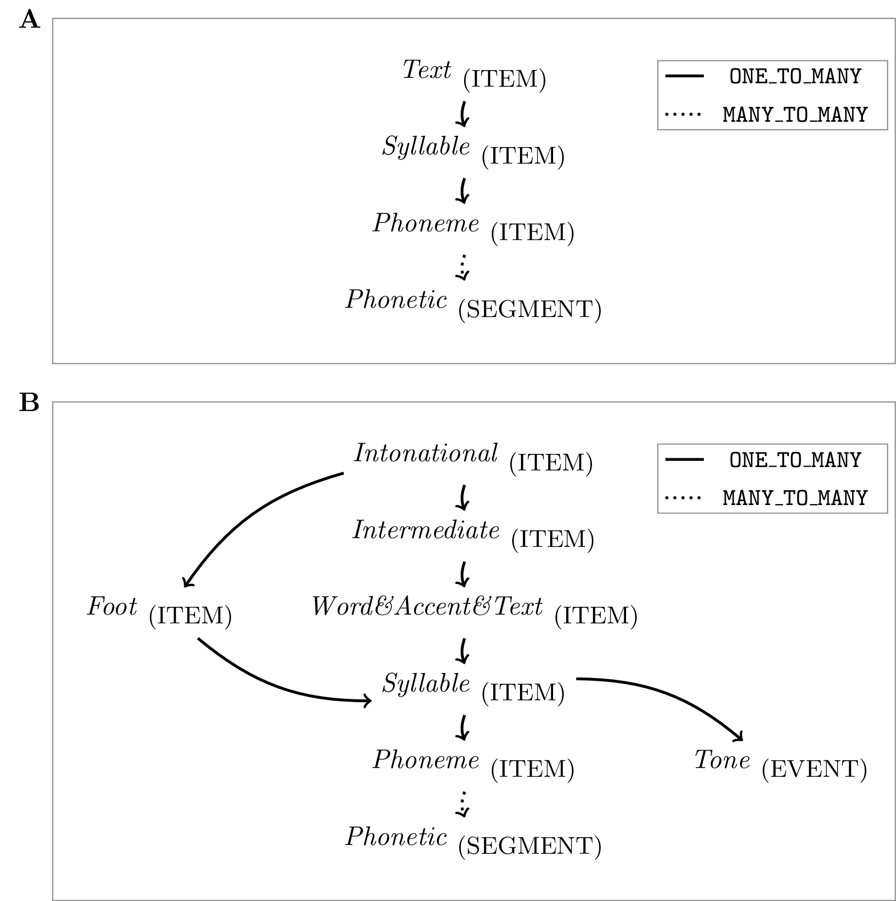

# (PART) Main components and concepts {-}

# Annotation Structure Modeling [^5]{#chap:annot_struct_mod}

[^5]: Sections of this chapter where previously published in @winkelmann:2017aa

The EMU-SDMS facilitates annotation structure modeling that surpasses that available in many other commonly used systems. This chapter provides an in-depth explanation of the annotation structure modeling capabilities the EMU-SDMS offers. One of the most common approaches for creating time-aligned annotations has been to differentiate between events that occur at a specific point in time but have no duration and segments that start at a point in time and have a duration. These annotation items are then grouped into time-ordered sets that are often referred to as tiers. As certain research questions benefit from different granularities of annotation, the timeline is often used to relate implicitly items from multiple tiers to each other as shown in Figure \@ref(fig:annot-structhybridAnnot)A. While sufficient for single or unrelated tier annotations, we feel this type of representation is not suitable for more complex annotation structures, as it results in unnecessary, redundant data and data sets that are often difficult to analyze. This is because there are no explicit relationships between annotation items, and it is often necessary to introduce error tolerance values to analyze slightly misaligned time values to find relationships iteratively over multiple levels. The main reason for the prevalence of this sub-optimal strategy is largely because the available software tools (e.g., Praat by @boersma:2011a) do not permit any other forms of annotations. These widely used annotation tools often only permit the creation and manipulation of segment and event tiers which in turn has forced users to model their annotation structures on these building blocks alone.

Linguists who deal with speech and language on a purely symbolic level tend to be more familiar with a different type of annotation structure modeling. They often model their structures in the form of a vertically oriented, directed acyclic graph that, but for a few exceptions that are needed for things like elision modeling (e.g., the /ɪ/ elision that may occur between the canonical representation of the word *family* /fæmɪli/ and its phonetic representation [fæmli]), loosely adheres to the formal definition of a tree in the graph-theoretical sense (@knuth:ar1968a) as depicted in Figure \@ref(fig:annot_structhybridAnnot)B. While this form of modeling explicitly defines relationships between annotation items (represented by dashed lines in Figure \@ref(fig:annot_structhybridAnnot)B), it lacks the ability to map these items to the timeline and therefore the matching speech signal.

(\#fig:annot-structhybridAnnot)**A:** a purely time-aligned annotation; **B:** a purely timeless, symbolic annotation; **C:** a time-aligned hierarchical annotation.

To our knowledge, the legacy EMU system (@cassidy:sc2001a) and its predecessors (e.g., @harrington:csl1993a) were the first to fuse pragmatically purely time-aligned and symbolic tree-like annotations. This was achieved by providing software tools that allowed for these types of annotation structures to be generated, queried and evaluated. In practice, each annotation item had its own unique identifier within the annotation. These unique IDs could then be used to reference each individual item and link them together using dominance relations to form the hierarchical annotation structure. On the one hand, this dominance relation implies the temporal inclusion of the linked sub-level items and was partially predicated on the *no-crossing constraint* as described in @coleman:lp1991a). This constraint does not permit the crossing of dominance relationships with respect to their sequential ordering (see also Section 4.2 of @cassidy:sc2001a). Since the dominance relations imply temporal inclusion, events can only be children in a parent-child relationship. To allow for timeless annotation items, a further timeless level type was used to complement the segment and event type levels used for time-aligned annotations. Each level of annotation items was stored as an ordered set to ensure the sequential integrity of both the time-aligned and timeless item levels. The legacy system also reduced data redundancy by allowing parallel annotations to be defined in the form of linearly linked levels for any given level (e.g., a segment level bearing SAMPA annotations as well as IPA UTF-8 annotations).

The new EMU-SDMS has adopted some concepts of the legacy system in that levels of type `SEGMENT` and `EVENT` contain annotation items with labels and time information, similar to the tiers known from other software tools such as Praat, while levels of type `ITEM` are timeless and contain annotation items with labels only. `SEGMENT` and `EVENT` levels differ in that units at the `SEGMENT`s level have a start time and a duration, while units at the `EVENT` level contain a single time point only. Additionally, every annotation item is able to contain multiple labels and has a unique identifier which is used to link items across levels. These building blocks provide the user with a general purpose annotation modeling tool that allows complex annotation structures to be modeled that best represent the data. An example of a time-aligned hierarchical annotation is depicted in Figure \@ref(fig:annot_structhybridAnnot)C, which essentially combines the annotation of Figure \@ref(fig:annot_structhybridAnnot)B with the most granular time-bearing level (i.e. the ``Phonetic'' level) of Figure \@ref(fig:annot_structhybridAnnot)A.

In accordance with other approaches (among others see @bird:sc2001a, @zipser:2010a, @ide:nle2004a), the EMU-SDMS annotation structure can be viewed as a graph that consists of three types of nodes (`EVENT`s, `SEGMENT`s, `ITEM`s) and two types of relations (`dominance` and `sequence`) which are directed, transitive and indicate the dominance and sequential relationships between nodes of the graph. As was shown in a pseudo-code example that converted an Annotation Graph (@bird:sc2001a) into the legacy EMU annotation format in @cassidy:sc2001a, these formats can be viewed as conceptually equivalent sub- or super-set representations of each other. This has also been shown by developments of meta models with independent data representation such as `Salt` (@zipser:2010a), which enable abstract internal representations to be derived that can be exported to equal-set or super-set formats without the loss of information. We therefore believe that the decision as to which data format serializations are used by a given application should be guided by the choice of technology and the target audience or research field. This is consistent with the views of the committee for the Linguistic Annotation Framework (LAF) who explicitly state in the ISO CD 24612 (LAF) document (@ISOLAF); 

> Although the LAF pivot format may be used in any context, it is assumed that users will represent annotations using their own formats, which can then be transduced to the LAF pivot format for the purposes of exchange, merging and comparison.

The transduction of an EMU annotation into a format such as the LAF pivot format is a simple process, as they share many of the same concepts and are well defined formats.

## Per database annotation structure definition

Unlike other systems, the EMU-SDMS requires the user to define the annotation structure formally for all annotations within a database. Much as Document Type Definition (DTD) or XML Schema Definition (XSD) describe the syntactically valid elements in an Extensible Markup Language (XML) document, the database configuration file of an `emuDB` defines the valid annotation levels and therefore the type of items that are allowed to be present in a database. Unlike DTDs or XSDs, the configuration file can also define semantic relationships between annotation levels which fall outside the scope of traditional, syntactically oriented schema definitions and validation. This global definition of an annotation structure has numerous benefits for the data integrity of the database, as the EMU-SDMS can perform consistency checks and prevent malformed as well as semantically void annotation structures [^6]. Because of these formal definitions, the EMU system generally distinguishes between the actual representations of a structural element which are contained within the database and their formal definitions. An example of an actual representation, that is a subset of the actual annotation, would be a level contained in an annotation file that contains `SEGMENT`s that annotate a recording. The corresponding formal definition would be a level definition entry in the database's configuration file, which specifies and validates the level's existence within the database.

[^6]: Although the consistency is ensured by the `EMU-SDMS` while annotation editing operations are performed, currently no actual consistency checks are performed while loading or saving an annotation. However, we plan to add this functionality in future releases.

As mentioned above, the actual annotation files of an `emuDB` contain the annotation items as well as their hierarchical linking information. To be able to check the validity of a connection between two items, the user specifies which links are permitted for the entire database just as for the level definitions. The permitted hierarchical relationships in an `emuDB` are expressed through link definitions between level definitions as part of the database configuration. There are three types of valid hierarchical relationships between levels: `ONE\_TO\_MANY`, `MANY_TO_MANY` and `ONE_TO_ONE`. These link definitions specify the permitted relationships between instances of annotation items of one level and those of another. The structure of the hierarchy that corresponds to the annotation depicted in Figure \@ref(fig:annot_structhybridAnnot)C can be seen in Figure \@ref(fig:annotStruct)A. The structure in Figure \@ref(fig:annotStruct)A is a typical example of an EMU hierarchy where only the \textit{Phonetic} level of type `SEGMENT` contains time information and the others are timeless as they are of the type `ITEM`. The top three levels, *Text*, *Syllable* and *Phoneme*, have a `ONE_TO_MANY` relationship specifying that a single item in the parent level may have a dominance relationship with multiple items in the child level. In this example, the relationship between \textit{Phoneme} and *Phonetic* is `MANY_TO_MANY`: this type of relationship can be used to represent schwa elision and subsequent sonorant syllabification, as when the final syllable of *sudden* is *d@n* at the *Phoneme* level but *dn* at the *Phonetic* level. Figure \@ref(fig:annotStruct)B displays an example of a more complex, intersecting hierarchical structure definition where Abercrombian feet (@abercombie:1967a) are incorporated into the tones and break indices (ToBI) (@beckman:1997aa) prosodic hierarchy by allowing an intonational phrase to be made up of one or more feet (for further details see @harrington:2010a page 98).

(\#fig:annotStruct)**A:** a schematic representation of the hierarchical structure of an `emuDB` that corresponds to the annotation depicted in @ref(fig:annot-structhybridAnnot)C; **B:** example of a more complex, intersecting hierarchical structure.

Based on our experience, the explicit definition of the annotation structure for every database which was also integral to the legacy system addresses the excessively expressive nature of annotational modeling systems mentioned in @bird:sc2001a. Although, in theory, infinitely large hierarchies can be defined for a database, users of the legacy system typically chose to use only moderately complex annotation structures. The largest hierarchy definitions we have encountered spanned up to fifteen levels while the average amount of levels was between three and five. This self-restriction is largely due to the primary focus of speech and spoken language domain-specific annotations, as the number of annotation levels between chunks of speech above the word level (intonational phrases/sentences/turns/etc.) and the lower levels (phonetic segmentation/EMA gestural landmark annotation/tone annotation/etc.) is a finite set.

## Parallel labels and multiple attributes

The legacy EMU system made a distinction between linearly and non-linearly linked inter-level links. Linearly linked levels were used to describe, enrich or supplement another level. For example, a level called *Category* might have been included as a separate level from *Word* for marking words' grammatical category memberships (thus each word might be marked as one of adjective, noun, verb, etc.), or information about whether or not a syllable is stressed might be included on a separate *Stress* tier (description taken from @harrington:2010a page 77). Using `ONE_TO_ONE` link definitions to define a relationship between two levels, it is still possible to model linearly linked levels in the new EMU-SDMS. However, an additional, cleaner concept that reduces the extra level overhead has been implemented that allows every annotation item to carry multiple attributes (i.e., labels). Further, using this construct reduces the number of levels, items and links and therefore the hierarchical complexity of an annotation. The generic term "attribute"" (vs. "label") was chosen to have the flexibility of adding attributes that are not of the type `STRING` (i.e., labels) to the annotation modeling capabilities of the EMU-SDMS in future versions. Figure \@ref(fig:paraLabels} shows the annotation structure modeling difference between linearly linked levels (see Figure \@ref(fig:paraLabels}A) and an annotation structure using multiple attributes (see Figure \@ref(fig:paraLabels}B). Figure \@ref(fig:paraLabels}A shows three separate levels (*Word*, *Accent* and  *Text*) that have a `ONE_TO_ONE` relationship. Each of their annotation items is linked to exactly one annotation item in the child level (e.g., *A1-A3*). Figure \@ref(fig:paraLabels}B shows a single level that has three attribute definitions (*Word*, *Accent* and *Text*) and each annotation item contains three attributes (e.g., *A1-A3*).

(\#fig:paraLabels)Schematic representation of annotation structure modeling difference between **A:** linearly linked levels and **B:** an annotation structure using multiple attributes.

It is worth noting that every level definition must have an attribute definition which matches its level name. This primary attribute definition must also be present in every annotation item belonging to a level. As `emuR`'s database interaction functions, such as `add_levelDefinition()`, and the `EMU-webApp` automatically perform the necessary actions this should only be of interest to (semi-)advanced users wishing to automatically generate the `_annot.json` format.

## Metadata strategy using single bundle root nodes

As the legacy EMU system and the new EMU-SDMS do not have an explicit method for storing metadata associated with bundles[^3], over the years an annotation structure convention has been developed to combat this issue. The convention is to use a generic top level (often simply called `bundle`) that contains a single annotation item in every annotation file. Using the multiple attribute annotation structure modeling capability of the EMU-SDMS, this single annotation item can hold any meta data associated with the bundle. Additionally linking the item to all the annotation items of its child level effectively makes it a parent to every item of the hierarchy. This linking information can later be exploited to query only bundles with matching meta data (see Chapter \@ref(chap:querysys} for details). Figure \@ref(fig:singleBundleRootNode} displays a hierarchical annotation where the top level (`bundle`) contains information about the speaker's `gender`, the city of birth (`COB`) and `age`.

[^3]: Future versions of `emuR` may allow `_meta.json` files containing meta information in the form of key-value pairs to be placed in either the `_emuDB`, the `_ses` or the `_bndl` directories.

(\#fig:singleBundleRootNode)Hierarchical annotation displaying single bundle root node metadata strategy where the label of the primary attribute definition (*bundle*) is empty, *gender* encodes the speaker's gender, *COB* encodes the speakers city of birth and *age* encodes the speaker's age in the form of a string.

## Conclusion

The annotation structure modeling capabilities of the EMU-SDMS surpass those of many other commonly used systems. They do so by not only allowing the use of levels containing time information (levels of type `SEGMENT` and `EVENT`) but also timeless levels (levels of type `ITEM`). Additionally, they allow users to define hierarchical annotation structures by allowing explicit links to be implemented from one level's items to those of another. Although it is not obligatory to use them in the EMU-SDMS, we feel the usage of hierarchical annotations allow for complex rich data modeling and are often cleaner representations of the annotations at hand.
