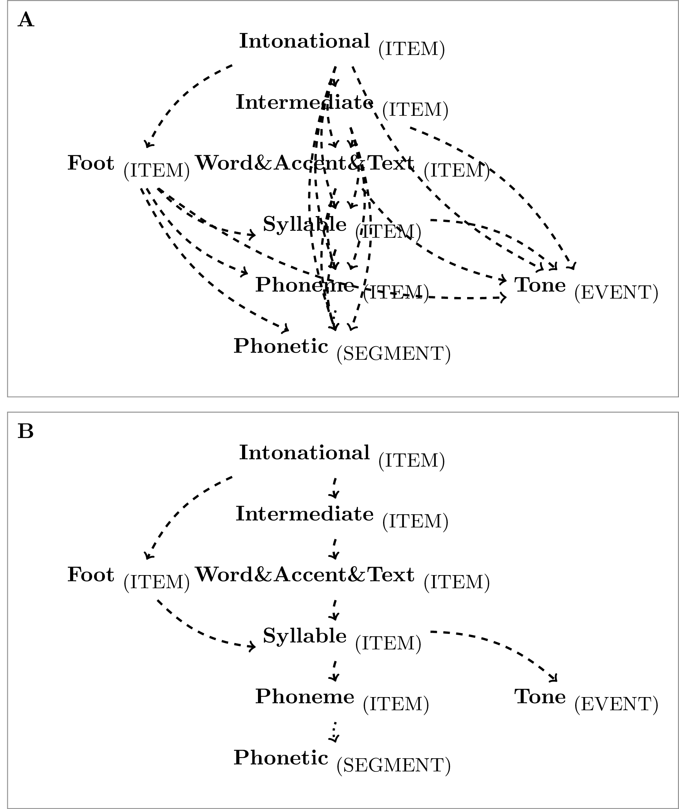

# (PART) Implementationx {-}

# Implementation of the query system [^1-chap:querysys_impl]{#chap:querysys_impl}

[^1-chap:querysys_impl]: Sections of this chapter have been published in @winkelmann:2017aa.

Compatibly with other query languages, the EQL defines the user a front-end interface and infers the query's results from its semantics. However, a query language does not define any data structures or specify how the query engine is to be implemented. As mentioned in Chapter \@ref(chap:overview), a major user requirement was database portability, simple package installation, tolerable run times over complex queries, and a system that did not rely on external software at runtime. The only available back-end implementation that met those needs and was also available as an R package at the time was (R)SQLite (@hipp:2007a, @wickham:2014a). As (R)SQLite is a relational database management system, `emuR`'s query system could not be implemented so as to use directly the primary data sources of an `emuDB`, that is, the JSON files described in Chapter \@ref(chap:emuDB). A syncing mechanism that maps the primary data sources to a relational form for querying purposes had to be implemented. This relational form is referred to as the `emuDBcache` in the context of an `emuDB`. The data sources are synchronized while an `emuDB` is being loaded and when changes are made to the annotation files. To address load time issues, we implemented a file check-sum mechanism which only reloads and synchronizes annotation files that have a changed MD5-sum [@rivest:1992a]. Figure \@ref(fig:query-schematic-emuR-structure) is a schematic representation of how the various `emuDB` interaction functions interact with either the file representation or the relational cache.

<!-- \begin{figure}[hpt] -->
<!-- \centering -->
<!--   \input{pics/emuRstruct} -->
<!--   \caption{Schematic architecture of `emuDB` interaction functions of the `emuR` package. \textcolor{three_color_c2}{Orange} paths show examples of functions interacting with the files of the `emuDB`, while \textcolor{three_color_c1}{green} paths show functions accessing the relational annotation structure. Actions like saving a changed annotation using the `EMU-webApp` first save the `\_annot.json` to disk then update the relational annotation structure.} -->
<!--   \label{fig:query_schematic_emuR_structure} -->
<!-- \end{figure} -->

(\#fig:query-schematic-emuR-structure)Schematic architecture of `emuDB` interaction functions of the `emuR` package. textcolor{three-color-c2}{Orange} paths show examples of functions interacting with the files of the `emuDB`, while 	extcolor{three-color-c1}{green} paths show functions accessing the relational annotation structure. Actions like saving a changed annotation using the `EMU-webApp` first save the `_annot.json` to disk then update the relational annotation structure.

Despite the disadvantages of cache invalidation problems, there are several advantages to having an object relational mapping between the JSON-based annotation structure of an `emuDB` and a relation table representation. One is that the user still has full access to the files within the directory structure of the `emuDB`. This means that external tools can be used to script, manipulate or simply interact with these files. This would not be the case if the files were stored in databases in a way that requires (semi-)advanced programming knowledge that might be beyond the capabilities of many users. Moreover, we can provide expert users with the option of using other relational database engines such as PostgreSQL, including all their performance-tweaking abilities, as their relational cache. This is especially valuable for handling very large speech databases.

The relational form of the annotation structure is split into six tables in the relational database to avoid data redundancy. The six tables are:

1. `emu_db`: containing `emuDB` information (columns: `uuid`, `name`),

<!-- \begin{tabular}{|c|c|} -->
<!--   \hline -->
<!--   \textbf{uuid} & \textbf{name} \\  -->
<!--   \hline -->
<!--   0fc618dc-8980-414d-8c7a-144a649ce199 & ae \\ -->
<!--   \hline -->
<!-- \end{tabular} -->

2. `session`: containing `session` information (columns: `db_uuid`, `name`),

<!-- \begin{tabular}{|c|c|} -->
<!--   \hline -->
<!--   \textbf{db\_uuid} & \textbf{name} \\  -->
<!--   \hline -->
<!--   0fc618dc-8980-414d-8c7a-144a649ce199 & 0000 \\ -->
<!--   \hline -->
<!--   \dots & \dots \\ -->
<!--   \hline -->
<!-- \end{tabular} -->

3. `bundle`: containing `bundle` information (columns: `db_uuid`, `session`, `name`, `annotates`, `sample_rate`, `md5\_annot\_json`),

<!-- \begin{tabular}{|c|c|c|c|c|c|} -->
<!--   \hline -->
<!--   \textbf{db\_uuid} & \textbf{ses\dots} & \textbf{name} & \textbf{annotates} & \textbf{sample\_r\dots} & \textbf{md5\_an\dots} \\  -->
<!--   \hline -->
<!--   0fc61\dots & 0000 & msajc003 & msajc003.wav & 20000 & 785c7\dots \\ -->
<!--   \hline -->
<!--   \dots & \dots & \dots & \dots & \dots & \dots \\ -->
<!--   \hline -->
<!-- \end{tabular} -->

4. `items`: containing all annotation items of `emuDB` (columns: `db_uuid`, `session`, `bundle`, `item_id`, `level`, `type`, `seq_idx`, `sample_rate`, `sample_point`, `sample_start`, `sample_dur`),

<!-- \begin{tabular}{|c|c|c|c|c|c|c} -->
<!--   \hline -->
<!--   \textbf{db\_uuid} & \textbf{session} & \textbf{bundle} & \textbf{item\_id} & \textbf{level} & \textbf{type} \\  -->
<!--   \hline -->
<!--   0fc61\dots & 0000 & msajc003 & 147 & Phonetic & SEGMENT & \\ -->
<!--   \hline -->
<!--   \dots & \dots & \dots & \dots & \dots & \dots \\ -->
<!--   \hline -->
<!-- \end{tabular} -->

<!-- \begin{tabular}{c|c|c|c|c|} -->
<!--   \hline -->
<!--   \textbf{seq\_idx} &\textbf{sample\_rate} & \textbf{sample\_point} & \textbf{sample\_start} & \textbf{sample\_dur} \\  -->
<!--   \hline -->
<!--   1 & 20000 & NA & 3749 & 1389 \\ -->
<!--   \hline -->
<!--   \dots & \dots & \dots & \dots & \dots \\ -->
<!--   \hline -->
<!-- \end{tabular} -->

5. `labels`: containing all labels belonging to all items (columns: `db_uuid`, `session`, `bundle`, `item_id`, `label_idx`, `name`, `label`), and

<!-- \begin{tabular}{|c|c|c|c|c|c|c|} -->
<!--   \hline -->
<!--   \textbf{db\_uuid} & \textbf{session} & \textbf{bundle} & \textbf{item\_id} & \textbf{label\_idx} & \textbf{name} & \textbf{label} \\  -->
<!--   \hline -->
<!--   0fc61\dots & 0000 & msajc003 & 147 & 1 & Phonetic & V \\ -->
<!--   \hline -->
<!--   \dots & \dots & \dots & \dots & \dots & \dots & \dots \\ -->
<!--   \hline -->
<!-- \end{tabular} -->

6. `links`: containing all links between annotation items of `emuDB` (columns: `db_uuid`, `session`, `bundle`, `from_id`, `to_id`, `label`).

<!-- \begin{tabular}{|c|c|c|c|c|c|c|} -->
<!--   \hline -->
<!--   \textbf{db\_uuid} & \textbf{session} & \textbf{bundle} & \textbf{from\_id} & \textbf{to\_id} & \textbf{label} \\ -->
<!--   \hline -->
<!--   0fc61\dots & 0000 & msajc003 & 8 & 7 & NA \\ -->
<!--   \hline -->
<!--   \dots & \dots & \dots & \dots & \dots & \dots \\ -->
<!--   \hline -->
<!-- \end{tabular} -->
<!-- \\ -->

While performing a query the engine uses an aggregate key to address every annotation item and its labels (`db_uuid`, `session`, `bundle`, `item_id`) and a similar aggregate key to dereference the links (`db_uuid`, `session`, `bundle`, `from_id` / `to_id`) which connect items. As the records in relational tables are not intrinsically ordered a further aggregate key is used to address the annotation item via its index and level (`uuid`, `session`, `bundle`, `level` / `seq_idx`). This is used, for example, during sequential queries to provide an ordering of the individual annotation items. It is worth noting that a plethora of other tables are created at query time to store various temporary results of a query. However, these tables are created as temporary tables during the query and are deleted on completion which means they are not permanently stored in the `emuDBcache`.

## Query expression parser {#sec:query-queryExpressionParser}

The query engine parses an EQL query expression while simultaneously executing partial query expressions. This ad-hoc string evaluation parsing strategy is different from multiple other query systems which incorporate a query planner stage to pre-parse and optimize the query execution stage (e.g., @hipp:2007a, @conway:2016a). Although no pre-optimization can be performed, this strategy simplifies the execution of a query as it follows a constant heuristic evaluation strategy. This section describes this heuristic evaluation and parsing strategy based on the EQL expression `[[Syllable == W -> Syllable == W] ^ [Phoneme == @ -> #Phoneme == s]]`.

The main strategy of the query expression parser is to recursively parse and split an EQL expression into left and right sub-expressions until a so-called Simple Query (SQ term is found and can be executed (see EBNF in Appendix \@ref(app-chap:EQL-EBNF) for more information on the elements comprising the EQL). This is done by determining the operator which is the first to be evaluated on the current expression. This operator is determined by the sub-expression grouping provided by the bracketing. Each sub-expression is then considered to be a fully valid EQL expression and once again parsed. Figure \@ref(fig:query-queryParserExample1), which is split into seven stages (marked S1-S7), shows the example EQL expression being parsed (S1-S3) and the resulting items being merged to meet the requirements of the individual operator (S4-S6) of the original query. S1 to S3 show the splitting operator character (e.g., textcolor{three_color_c3}{`->`} in purple) which splits the expression into a textcolor{three_color_c1}{left} (green) and textcolor{three_color_c2}{right} (orange) sub-expression.

<!-- \begin{figure}[hpt] -->
<!-- \centering -->
<!-- \input{pics/queryParserExample1} -->
<!-- \caption{Example of how the query expression parser parses and evaluates an EQL expression and merges the result according to the respective EQL operators.} -->
<!-- \label{fig:query_queryParserExample1} -->
<!-- \end{figure} -->

The result modifier symbol (`#`) is noteworthy for its extra treatment by the query engine as it places an exact copy of the items marked by it into its own intermediary result storage (see \#*s*~items~ node on S7 in Figure \@ref(fig:query-queryParserExample1)). After performing the database operations necessary to do the various merging operation which are performed on the intermediary results, this storage is updated by removing items from it that are no longer present due to the merging operation. As a final step, the query engine evaluates if there are items present in the intermediary result storage created by the presence of the result modifier symbol. If so, these items are used to create an `emuRsegs` object by deriving the time information and extracting the necessary information from the intermediate result storage. If no items are present in the result modifier storage, the query engine uses the items provided by the final merging procedure in S3 instead (which is not the case in the example used in Figure \@ref(fig:query-queryParserExample1)).

A detailed description of how this query expression parser functions is presented in a pseudo code representation in Algorithms \@ref(alg:query-implQueryEnginePC-p1) and \@ref(alg:query-implQueryEnginePC-p2)[^2-chap:querysys_impl]. For simplicity, this representation ignores the treatment of the result modifier symbol (\#) and focuses on the parsing and evaluation strategy of the query expression parser. As stated previously, the presence of the result modifier before an SQ triggers the query engine to place a copy of the result of that SQ into an additional result table, which is then updated throughout the rest of the query. The starting point for every query is the `query()` function (see line \@ref(alg:query-implQueryEnginePC-p2:line:query) in Algorithm \@ref(alg:query-implQueryEnginePC-p2)). This function places the filtered items, links and labels entries that are relevant for the current query into temporary tables. Depending on which query terms and operators are found, the EQL query engine uses the various sub-routines displayed in Algorithms \@ref(alg:query-implQueryEnginePC-p1) and \@ref(alg:query-implQueryEnginePC-p2) to parse and evaluate the EQL expression.

[^2-chap:querysys_impl]: The R code that implements this pseudo code can be found here: https://github.com/IPS-LMU/emuR/blob/master/R/emuR-query.database.R.

<!-- %%%%%%%%%%%%%%%%%%%%%%%%%%%%%%%%%% -->
<!-- % -->
<!-- \begin{algorithm} -->
<!--     \caption{Pseudo Code for Query Engine Algorithm - Part 1} -->
<!--     \begin{algorithmic}[1] % The number tells where the line numbering should start -->
<!--     %%%%%%%%%%%%%%%%%%% -->
<!--     \Function{query\_DbEqlFUNCQ}{$query$} -->
<!--       \State $place\ all\ parent\ level\ items\ into\ tmp\ table$ -->
<!--       \State $place\ all\ child\ level\ items\ into\ tmp\ table$ -->
<!--       \State \Call{query\_DbHier}{$parentItemsTable$, $childItemsTable$} -->
<!--       \If {$Start\ End\ or\ Medial\ query$} -->
<!--         \State $extract\ parent\ items\ and\ place\ in\ tmp\ result\ table$ -->
<!--       \Else -->
<!--         \State $extract\ child\ items\ and\ place\ in\ tmp\ result\ table$ -->
<!--       \EndIf -->
<!-- 		\EndFunction -->
<!--     %%%%%%%%%%%%%%%%%%% -->
<!--     \Function{query\_DbEqlLABELQ}{$query$} -->
<!--       \State $splitLabels \gets split\ labels\ at\ |$ -->
<!--       \ForAll{$splitLabels$} -->
<!-- 				\If {operator is $==$, $=$ or $!=$} -->
<!--     	    \State $extract\ items\ that\ contain\ labels\ which\ are\ equal\ or\ unequal\ to\ label$ -->
<!-- 		    \ElsIf{operator is $=~$ or $!\sim$} -->
<!-- 			    \State $extract\ items\ that\ contain\ labels\ that\ match\ or\ don't\ match\ RegEx$ -->
<!-- 		    \EndIf -->
<!-- 		    \State $merge\ results\ in\ tmp\ table$ -->
<!-- 			\EndFor -->
<!-- 		\EndFunction -->
<!--     %%%%%%%%%%%%%%%%%%% -->
<!--     \Function{query\_DbEqlSQ}{query} -->
<!-- 			\If {$query\ contains\ round\ brackets$} -->
<!-- 				\State \Call{query\_DbEqlFUNCQ}{$query$} -->
<!-- 			\Else -->
<!-- 				\State \Call{query\_DbEqlLABELQ}{$query$} -->
<!-- 			\EndIf -->
<!-- 		\EndFunction -->
<!--     %%%%%%%%%%%%%%%%%%% -->
<!--     \Function{query\_DbEqlCONJQ}{query} -->
<!-- 			\State $splitItems \gets split\ query\ at\ \&$ -->
<!-- 			\ForAll{$splitItems$} -->
<!-- 				\State \Call{query\_DbEqlSQ}{$splitItems$} -->
<!-- 				\State $merge\ results\ in\ tmp\ table$ -->
<!-- 			\EndFor -->
<!-- 		\EndFunction -->
<!--     %%%%%%%%%%%%%%%%%%% -->
<!--     \Function{query\_DbHier}{$leftTable$, $rightTable$} -->
<!--       \State $hp \gets extract\ hier.\ paths\ conn.\ leftTable\ and\ rightTable\ level\ names$ -->
<!--       \ForAll{$child\ and\ parent\ level\ pairs\ in\ hp$} -->
<!--         \State $connect\ child\ and\ parent\ items\ using\ links\ table$ -->
<!--         \State $reduce\ to\ min\ seq.\ idx\ (left\ side\ of\ trapeze)$ -->
<!--         \State $and\ to\ max\ seq.\ idx\ (right\ side\ of\ trapeze)$ -->
<!--       \EndFor -->
<!-- 		\EndFunction -->
<!--     %%%%%%%%%%%%%%%%%%%% -->
<!--     \algstore{testcont}  -->
<!--     \end{algorithmic} -->
<!--     \label{alg:query_implQueryEnginePC_p1} -->
<!-- \end{algorithm} -->

<!-- %%%%%%%%%%%%%%%%%%%%%%%%%%%%%%%%%% -->
<!-- % -->
<!-- \begin{algorithm} -->
<!--     \caption{Pseudo Code for Query Engine Algorithm - Part 2} -->
<!--     \begin{algorithmic}[1] % The number tells where the line numbering should start -->
<!--     \algrestore{testcont} -->
<!-- 		%%%%%%%%%%%%%%%%%%%% -->
<!--     \Function{query\_DbEqlInBracket}{$query$} -->
<!--       \State $qTrim \gets remove\ outer\ square\ brackets$ -->
<!--   	  \State $leftQuery,\ rightQuery \gets split\ qTrim\ at\ cur.\ operator$ -->
<!--   	  \State \Call{query\_databaseWithEql}{$leftQuery$} \Comment{recursive part of query} -->
<!--   	  \State \Call{query\_databaseWithEql}{$rightQuery$} \Comment{recursive part of query} -->
<!--   	  \If {$cur.\ operator\ is\ domintation\ operator$} -->
<!--         \State \Call{query\_DbHier}{$leftQueryResultTable$, $rightQueryResultTable$} -->
<!--   	   \ElsIf{$cur.\ operator\ is\ seq.\ operator$} -->
<!--   	    \State $find\ seq.\ of\ leftQueryResultTable\ and\ rightQueryResultTable\ items$ -->
<!--   	   \Else -->
<!--   	    \State \Call{query\_databaseWithEql}{$qTrim$} -->
<!--   	 \EndIf -->
<!-- 		\EndFunction -->
<!--     %%%%%%%%%%%%%%%%%%%% -->
<!--     \Function{query\_DbWithEql}{$query$} -->
<!--       \If {$query\ isn't\ wrapped\ in\ brackets$} -->
<!--     	  \State \Call{query\_DbEqlCONJQ}{$query$} -->
<!-- 		  \Else -->
<!-- 			  \State \Call{query\_DbEqlInBracket}{$query$} -->
<!-- 		  \EndIf -->
<!-- 		\EndFunction -->
<!--     %%%%%%%%%%%%%%%%%%%% -->
<!--     \Function{query}{$query$, $sesPattern$, $bndlPattern$} \label{alg:query_implQueryEnginePC_p2:line:query} -->
<!--     	\State $filter\ items\ in\ relational\ tables\ by\ sesPattern$ -->
<!--     	\State $filter\ items\ in\ relational\ tables\ by\ bndlPattern$ -->
<!--       \State \Call{query\_DbWithEql}{$query$} -->
<!--       \State $seglist\gets$ \Call{convert\_queryResultToEmuRsegs}{$tmpResultTableName$} -->
<!--       \State \textbf{return} $seglist$ -->
<!--     \EndFunction -->
<!--     %%%%%%%%%%%%%%%%%%%% -->
<!--     \end{algorithmic} -->
<!--     \label{alg:query_implQueryEnginePC_p2} -->
<!-- \end{algorithm} -->

## Redundant links {#subsec:query-redundantLinks}

A noteworthy difference between the legacy and the new EMU system is how hierarchies are stored. The legacy system stored the linking information of a hierarchy in so-called hierarchical label files, which were plain text files that used the `.hlb` extensions. Within the label files this information was stored in space/blank separated lines:

<!-- \begin{Verbatim}[commandchars=\\\{\},codes={\catcode`$=3\catcode`^=7\catcode`_=8}] -->
<!-- \textcolor{three_color_c1}{111} \textcolor{three_color_c2}{139 140 141 173 174 175 185} -->
<!-- \textcolor{three_color_c1}{112} \textcolor{three_color_c2}{142 143 176 177} -->
<!-- \textcolor{three_color_c1}{113} \textcolor{three_color_c2}{144 145 146 178 179 180} -->
<!-- \textcolor{three_color_c1}{114} \textcolor{three_color_c2}{147} -->
<!-- \textcolor{three_color_c1}{115} \textcolor{three_color_c2}{148} -->
<!-- \textcolor{three_color_c1}{116} \textcolor{three_color_c2}{149}, -->
<!-- \end{Verbatim} -->

where the textcolor{three_color_c1}{first number} (green) of each line was the parent's ID and the textcolor{three_color_c2}{following numbers} (orange) indicated the annotation items the parent was linked to. However, it was not just links to the items on the child level that were stored in each line. Rather, a link to all children of all levels below the parent level was stored for each parent item. This was likely due to performance benefits in parsing and mapping onto the internal structures used by the legacy query engine. A schematic representation of this form of linking is displayed in Figure \@ref(fig:query-redundant)A. As these redundant links are prone to errors while updating the data model and lead to a convoluted annotation structure models (see excessive use of dashed lines in Figure \@ref(fig:query-redundant)A), we chose to eliminate them and opted for the cleaner, non-redundant representation displayed in Figure \@ref(fig:query-redundant)B. Although this led to a more complex query parser engine for hierarchical queries and functions, we feel it is a cleaner, more accurate and more robust data representation.

<!-- \begin{figure}[hpt] -->
<!-- \centering -->
<!-- \input{pics/aeGraph_redundant.tex} -->
<!-- \caption{Schematic of hierarchy graph *ae*; \textbf{A}: legacy redundant strategy vs. \textbf{A}: cleaner non-redundant strategy.} -->
<!-- \label{fig:query_redundant} -->
<!-- \end{figure} -->

(\#fig:query-redundant)Schematic of hierarchy graph *ae*; 	extbf{A}: legacy redundant strategy vs. 	extbf{A}: cleaner non-redundant strategy.

