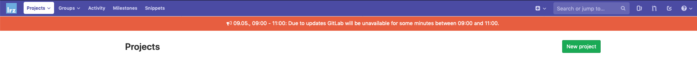
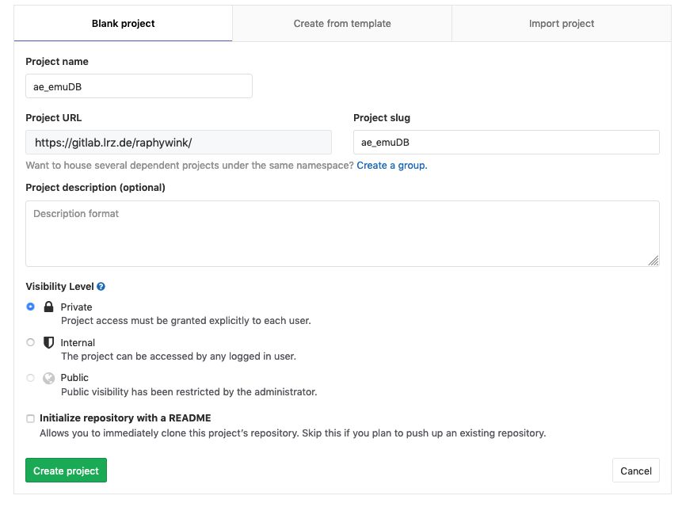
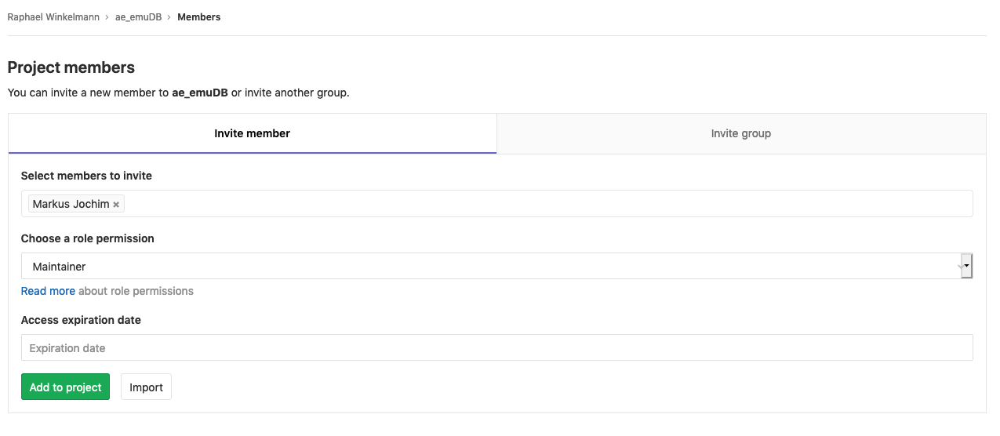

# Version control of emuDBs including collaborative annotation with Git and GitLab


This document describes how to do Git versioning of an emuDB for collaboratively working on and annotating speech databases. In this recipe we will focus on using the GitLab instance provided by the [LRZ](https://www.lrz.de/) (https://gitlab.lrz.de/). However, any GitLab instance available to you should work. It is worth noting that GitLab instances may vary in the allowed maximum size of a Git repository. As emuDBs tend to be a lot larger than an avarege code repository, please make sure you comply with your instance's size limits. ^[As of now, the GitLab API doesn't support fetching and posting of LFS (large file storage) files. This is also true for the `git2r` package. Once this is available, we will update this documentation on how to use this feature.]

As we will be using an R package called `git2r`, please make sure it is installed:


```r
install.packages("git2r")
```

As this recipe uses features that aren't available in the current CRAN release of emuR, please also install the current developer version from GitHub (needed version >= 2.0.4.9000):


```r
devtools::install_github("IPS-LMU/emuR")
```

Next let us load the needed packages:


```r
library(emuR)
library(git2r)
```

## Setup

The first thing we need to do is create and load an example emuDB:


```r
library(emuR)
create_emuRdemoData()
db = load_emuDB(file.path(tempdir(),
                          "emuR_demoData",
                          "ae_emuDB"),
                verbose = F)
```

As the ae emuDB is not yet under Git version control, we will proceed by initialising a new Git repository in the emuDB directory using `git2r`:


```r
# git2r:: prefix can be omitted
repo = git2r::init(path = db$basePath)
```

This is followed by a basic user configuration:


```r
git2r::config(repo, 
              user.name = "Raphael Winkelmann", # change to your user name
              user.email = "raphael@example.org") # and email
```

Now we will add everything to the Git repository and create our initial commit. In a terminal, type:


```r
# add everything
git2r::add(db$basePath, path = "*")
# and commit
git2r::commit(db$basePath, 
              message = "initial commit")
```

```
## [c64f381] 2019-11-18: initial commit
```

This is it for the initial local setup of Git. If you just wish to work locally, simply repeat the above two commands every time you wish to commit the current state of the emuDB to the repository (don't forget to use a concise commit message).

### Using GitLab to host the emuDB

The above examples only work on a local Git repository that is located inside of the emuDB directory (contained in a hidden directly called `.git`). Although this is already beneficial, as we have versioning enabled for our emuDB and can also go back to previous versions, it doesn't utilise one of Git's most powerful features. Git is able to sync repository states between multiple machines. Here, we will use GitLab to host the emuDB.

Initially you need to create a new project in GitLab under `Projects -> New project`:



that has the same name as the emuDB:



Make sure to change the `Project slug` to match the casing (\_emuDB vs. emudb) of the database suffix. The URL of the repository should now be something like: https://gitlab.lrz.de/raphywink/ae_emuDB.git. Next, we will add the newly created remote repo to the configuration of the local repo. In the R console type:


```r
git2r::remote_add(db$basePath, 
                  name = "origin", 
                  url = "https://gitlab.lrz.de/raphywink/ae_emuDB.git")
```

To be allowed to push to the remote repository we will use personal access tokens provided by GitLab. In GitLab, navigate to `Settings` -> `Access Tokens` and create a personal access token with a fitting name and an **api** scope.


Once a private token was created and copied, add the following line to your `$HOME/.Renviron` file (the location of the `.Renviron` file may vary on Windows):


```r
GITLAB_PAT="reQFspQnbCHbvTfHjwfP" # replace with own access token
```

The `.Renviron` file is read during R's start-up – therefore you need to close and reopen RStudio. Adding the token to your `.Renviron` file has the advantage that you will not have to include it in your R scripts, which allows you to share these scripts without the need to redact the secret token.

A note on security: Personal access tokens like the above grant full access to your GitLab account. It is therefore to be treated the same way a password is! In other words: Is is meant for your eyes only. If a token gets lost or stolen, please revoke the token immediately (GitLab: `Settings` -> `Access Tokens` -> `Revoke`)!!!!

Now that the token is set up, we can use it to push the emuDB to the GitLab instance:


```r
git2r::push(db$basePath, 
            name = "origin",
            refspec = "refs/heads/master",
            set_upstream = TRUE,
            credentials = git2r::cred_token(token = "GITLAB_PAT"))
```

To pull any changes from the remote repository, simply type:


```r
git2r::pull(db$basePath, 
            credentials = git2r::cred_token(token = "GITLAB_PAT"))
```

## Collaborating with others

If you wish others to access and/or collaborate with you on the database, you simply have to add them as "Project members" in GitLab. Under `Project -> Settings -> Members`, select your collaborator and choose "Maintainer" (read and write access) as their role permission:



Once this is set, the collaborator is able to clone the repository using their own credentials (they have to create a personal access token just like you did, see above):


```r
git2r::clone(url = "https://gitlab.lrz.de/raphywink/ae_emuDB.git",
             local_path = "save/in/this/dir",
             credentials = git2r::cred_token(token = "GITLAB_PAT"))
```

### Default work-flow

When collaborating with multiple people, it is usually a good idea to do the following:

1.) **every time** before you start working on an emuDB, get the newest version:


```r
git2r::pull(db$basePath, 
            credentials = git2r::cred_token(token = "GITLAB_PAT"))
```

2.) once you have made changes that you wish to share, create a new commit and push it to the remote repository so the others can access your changes:


```r
# add everything with "*"
git2r::add(db$basePath, "*")
git2r::commit(db$basePath, 
              message = "added new bundleList")
```

Once again, remember to write a helpful and concise commit message.


### Assigning bundles to annotators

How the EMU-SDMS handles user management/collaborative annotations is quite simple. Within an emuDB you can create an optional directory called `bundleLists/`. Within that directory you can place so-called bundle list JSON files. An example of such a file is shown below.


```json
[
    {
        "session": "0000",
        "name": "msajc012",
        "comment": "vowel offset unclear",
        "finishedEditing": false
    },
    {
        "session": "0000",
        "name": "msajc010",
        "comment": "",
        "finishedEditing": false
    }
...
```

These files describe, what bundles are allocated to a certain user. The name of the files indicate which user the assignment belongs to e.g. `raphael.winkelmann_bundleList.json`. As of emuR version 2.0.4.9000 (currently only available on GitHub with `devtools::install_github("IPS-LMU/emuR")`) it is possible to read and write these bundle lists:


```r
# list all files in session "0000"
bndls = list_bundles(db, 
                     session = "0000")
# write these to a bundle list called raphael.winkelmann
# therefore assigning them to that user 
write_bundleList(db, 
                 name = "raphael.winkelmann", 
                 bndls)
```

```
## [1] "INFO: No bundleList dir found in emuDB (path: /tmp/RtmpBxN2q2/emuR_demoData/ae_emuDB/bundleLists)! Creating directory..."
```

```r
# and read that bundle list to check its content
read_bundleList(db, 
                name = "raphael.winkelmann")
```

```
## # A tibble: 7 x 4
##   session name     comment finishedEditing
##   <chr>   <chr>    <chr>   <lgl>          
## 1 0000    msajc003 ""      FALSE          
## 2 0000    msajc010 ""      FALSE          
## 3 0000    msajc012 ""      FALSE          
## 4 0000    msajc015 ""      FALSE          
## 5 0000    msajc022 ""      FALSE          
## 6 0000    msajc023 ""      FALSE          
## 7 0000    msajc057 ""      FALSE
```

This newly created `raphael.winkelmann_bundleList.json` file now has to be added to the repository, commited and pushed to GitLab:


```r
# add everything with "*" as nothing else has changed
git2r::add(db$basePath, "*")
git2r::commit(db$basePath, 
              message = "added new bundleList")
# and push to GitLab
git2r::push(db$basePath, 
            credentials = git2r::cred_token(token = "GITLAB_PAT"))
```

Next, the annotator would have to be added to the GitLab repository as a collaborator so she/he has read and write access.

### Pointing the EMU-webApp to the GitLab repository

As of version 1.1.0 of the EMU-webApp it can communicate directly with a emuDB repository hosted by GitLab. Pointing the EMU-webApp to a GitLab repository is achieved using URL parameters. The URL parameters are as follows:

- `autoConnect=true`: automatically connect to the instance (obligatory)
- `comMode=GITLAB`: communication mode = "GITLAB" (using the GitLab API)
- `gitlabURL=https://gitlab.lrz.de`: URL of GitLab instance
- `projectID=44728`: project ID (see project page of GitLab to determine the project's ID)
- `emuDBname=ae`: name of the emuDB (used to identify the prefix of the `_DBconfig.json` file)
- `bundleListName=raphael.winkelmann`: name of bundleList to access
- `privateToken=reQFspQnbCHbvTfHjwfP`: used for read and write access (**Do not share your own personal access token; tell the annotators to insert their own instead!**)

These URL parameters are then used to construct a URL like the following: https://ips-lmu.github.io/EMU-webApp/?autoConnect=true&comMode=GITLAB&gitlabURL=https:%2F%2Fgitlab.lrz.de&projectID=44728&emuDBname=ae&bundleListName=test.user&privateToken=reQFspQnbCHbvTfHjwfP

This step is usually performed by the project maintainer and the URLs are simply sent to the various annotators in the project. The only parameters the annotators have to set themselves is their `privateToken`s. Once the link is opened in a browser, the EMU-webApp will have full read and write access to the repository and should open the first bundle in the bundle list automatically. While saving a bundle, a new commit with all updates is added to the repository.

#### Caveat

As the annotators have full read and write access to the GitLab emuDB repository, they could in theory edit/delete things that were not assigned to them via the bundle list mechanism. Currently the only way to avoid this is by creating separate emuDB repos for each annotator. However, remember that you are using a distributed Git repository, so in most cases you can simply go back in time if something gets deleted.


### What about my R scripts / other files?

Although ultimately up to the user (the possibilities with Git are basically endless), we recommend keeping the analysis scripts separate from the emuDB for a better separation of concerns (e.g. you might want to share your database but not your "messy" analysis script :-)). This can for example be done using a new R Studio project (`File -> New Project...` in R Studio) which once again is put under Git version control (usually no Git-LFS necessary). If a combination of the emuDB and the analysis Project is desired, I would recommend looking into Git submodules: https://git-scm.com/book/en/v2/Git-Tools-Submodules
