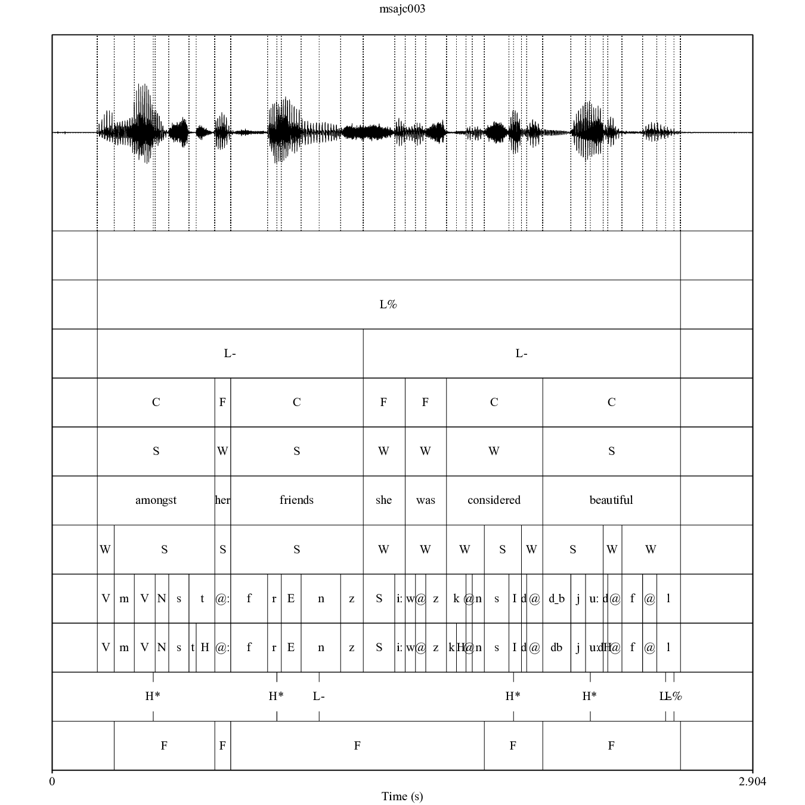

# A tutorial on how to use the EMU-SDMS [^1-chap:tutorial]{#chap:tutorial}

[^1-chap:tutorial]: Some examples of this chapter are adapted versions of examples of the `emuR_intro` vignette.

```{r echo=FALSE, results='hide', message=FALSE}
# clean up emuR_demoData
unlink(file.path(tempdir(), "emuR_demoData"), recursive = TRUE)
unlink(file.path(tempdir(), "myFirst_emuDB"), recursive = TRUE)
```

```{r queryEngineWorkFlow, fig.align="center", echo=FALSE, out.width = "65%"}
knitr::include_graphics("pics/emuSdmsBirdsEye.png")
```

Using the tools provided by the EMU-SDMS, this tutorial chapter gives a practical step-by-step guide to answering the question: *Given an annotated speech database, is the vowel height of the vowel @ (measured by its correlate, the first formant frequency) influenced by whether it appears in a content or function word?* The tutorial only skims over many of the concepts and functions provided by the EMU-SDMS. In-depth explanations of the various functionalities are given in later chapters of this documentation.

As the EMU-SDMS is not concerned with the raw data acquisition, other tools such as SpeechRecorder by @draxler:2004a are first used to record speech. However, once audio speech recordings are available, the system provides multiple conversion routines for converting existing collections of files to the new `emuDB` format described in Chapter \@ref(chap:emuDB) and importing them into the new EMU system. The current import routines provided by the `emuR` package are:

- `convert_TextGridCollection()` - Convert TextGrid collections (`.wav` and `.TextGrid` files) to the `emuDB` format,
- `convert_BPFCollection()` - Convert Bas Partitur Format (BPF) collections (`.wav` and `.par` files) to the `emuDB` format,
- `convert_txtCollection()` - Convert plain text file collections format (`.wav` and `.txt` files) to the `emuDB` format,
- `convert_legacyEmuDB()` - Convert the legacy EMU database format to the `emuDB` format and
- `create_emuDB()` followed by `add_link/levelDefinition` and `import_mediaFiles()` - Creating `emuDB`s from scratch with only audio files present.


The `emuR` package comes with a set of example files and small databases that are used throughout the `emuR` documentation, including the functions help pages. These can be accessed by typing `help(functionName)` or the short form `?functionName`. R code snippet below illustrates how to create this demo data in a user-specified directory. Throughout the examples of this documentation the directory that is provided by the base R function `tempdir()` will be used, as this is available on every platform supported by R (see `?tempdir` for further details). As can be inferred from the `list.dirs()` output in the below code, the `emuR_demoData` directory contains a separate directory containing example data for each of the import routines. Additionally, it contains a directory containing an `emuDB` called *ae* (the directories name is `ae_emuDB`, where `_emuDB` is the default suffix given to directories containing a `emuDB`; see Chapter \@ref(chap:emuDB)).

```{r results='show', message=FALSE, rexample=TRUE}
# load the package
library(emuR)

# create demo data in directory provided by the tempdir() function
# (of course other directory paths may be chosen)
create_emuRdemoData(dir = tempdir())

# create path to demo data directory, which is
# called "emuR_demoData"
demoDataDir = file.path(tempdir(), "emuR_demoData")

# show demo data directories
list.dirs(demoDataDir, recursive = F, full.names = F)
```

This tutorial will start by converting a TextGrid collection containing seven annotated single-sentence utterances of a single male speaker to the `emuDB` format[^2-chap:tutorial]. In the EMU-SDMS, a file collection such as a TextGrid collection refers to a set of file pairs where two types of files with different file extentions are present (e.g., `.ext1` and `.ext2`). It is vital that file pairs have the same basenames (e.g., `A.ext1` and `A.ext2` where `A` represents the basename) in order for the conversion functions to be able to pair up files that belong together. As other speech software tools also encourage such file pairs (e.g., @kisler:2015a) this is a common collection format in the speech sciences. The R code snippet below shows such a file collection that is part of `emuR`'s demo data. Figure \@ref(fig:msajc003-praatTG) shows the content of an annotation as displayed by Praat's `"Draw visible sound and Textgrid..."` procedure.


[^2-chap:tutorial]: The other input routines are covered in the Section \@ref(sec:emuRpackageDetails_importRoutines).

```{r rexample:showTGcolContent, results='show', message=FALSE, rexample=TRUE}
# create path to TextGrid collection
tgColDir = file.path(demoDataDir, "TextGrid_collection")

# show content of TextGrid_collection directory
list.files(tgColDir)
```


```{r msajc003-praatTG, fig.cap="TextGrid annotation of the `emuR_demoData/TextGrid_collection/msajc003.wav` / `.TextGrid` file pair containing the tiers (from top to bottom): *Utterance*, *Intonational*, *Intermediate*, *Word*, *Accent*, *Text*, *Syllable*, *Phoneme*, *Phonetic*, *Tone*, *Foot*.", fig.align="center", echo=FALSE, out.width = "85%"}

```


## Converting the TextGrid collection

The `convert_TextGridCollection()` function converts a TextGrid collection to the `emuDB` format. A precondition that all `.TextGrid` files have to fulfill is that they must all contain the same tiers. If this is not the case, yet there is an equal tier subset that is contained in all the TextGrid files, this equal subset may be chosen. For example, if all `.TextGrid` files contain only the tier `Phonetic: IntervalTier` the conversion will work. However, if a single `.TextGrid` of the collection has the additional tier `Tone: TextTier` the conversion will fail. In this case the conversion could be made to work by specifying the equal subset (e.g., `equalSubset = c("Phonetic")`) and passing it on to the `tierNames` function argument `convert_TextGridCollection(..., tierNames = equalSubset, ...)`. As can be seen in Figure \@ref(fig:msajc003-praatTG), the TextGrid files provided by the demo data contain eleven tiers. To reduce the complexity of the annotations for this tutorial we will only convert the tiers *Word* (content: *C* vs. function: *F* word annotations), *Syllable* (strong: *S* vs. weak: *W* syllable annotations), *Phoneme* (phoneme level annotations) and *Phonetic* (phonetic annotations using Speech Assessment Methods Phonetic Alphabet (SAMPA) symbols - @wells:1997aa) using the `tierNames` parameter. This conversion can be seen in the R code snippet below.


```{r results='hide', message=FALSE, rexample=TRUE}
# convert TextGrid collection to the emuDB format
convert_TextGridCollection(dir = tgColDir,
                           dbName = "myFirst",
                           targetDir = tempdir(),
                           tierNames = c("Word", "Syllable",
                                         "Phoneme", "Phonetic"))
```

The above call to `convert_TextGridCollection()` creates a new `emuDB` directory in the `tempdir()` directory called `myFirst_emuDB`. This `emuDB` contains annotation files that contain the same *Word*, *Syllable*, *Phoneme* and *Phonetic* segment tiers as the original `.TextGrid` files as well as copies of the original (`.wav`) audio files. For further details about the structure of an `emuDB`, see Chapter \@ref(chap:emuDB) of this document.


## Loading and inspecting the database

As mentioned in Section \@ref(sec:overview-sysArch), the first step when working with an `emuDB` is to load it into the current R session. The R code snippet below shows how to load the converted TextGrid collection into R using the `load_emuDB()` function.

```{r results='hide', message=FALSE, rexample=TRUE}
# get path to emuDB called "myFirst"
# that was created by convert_TextGridCollection()
path2directory = file.path(tempdir(), "myFirst_emuDB")

# load emuDB into current R session
dbHandle = load_emuDB(path2directory, verbose = FALSE)
```

### Overview

Now the *myFirst* `emuDB` is loaded into R, an overview of the current status and configuration of the database can be displayed using the `summary()` function as shown the below R code snippet.


```{r rexample:tutorial_summary, rexample=TRUE, tidy.opts=list(width.cutoff = 30)}
# show summary
summary(dbHandle)
```


The extensive output of `summary()` is split into a top and bottom half, where the top half focuses on general information about the database (name, directory, annotation item count, etc.) and the bottom half displays information about the various SSFF track, level and link definitions of the `emuDB`. The summary information about the level definitions shows, for instance, that the *myFirst* database has a *Word* level of type `SEGMENT` and therefore contains annotation items that have a start time and a segment duration. It is worth noting that information about the SSFF track, level and link definitions corresponds to the output of the `list_ssffTrackDefinitions()`, `list_levelDefinitions()` and `list_linkDefinitions()` functions.

### Database annotation and visual inspection

The EMU-SDMS has a unique approach to annotating and visually inspecting databases, as it utilizes a web application called the `EMU-webApp` to act as its GUI. To be able to communicate with the web application the `emuR` package provides the `serve()` function which is used in the R code snippet below.

```{r eval=FALSE, rexample=TRUE}
# serve myFirst emuDB to the EMU-webApp
serve(dbHandle)
```

Executing this command will block the R console, automatically open up the system's default browser and display the following message in the R console:

```{r echo=FALSE}
cat(paste0(
  "Navigate your browser to the EMU-webApp URL: \n",
  "\thttp://ips-lmu.github.io/EMU-webApp/ (should happen autom...\n",
  "Server connection URL:\n",
  "\tws://localhost:17890\n",
  "To stop the server press the 'clear' button in the \n",
  "EMU-webApp or close/reload the webApp in your browser.\n"))
```

The `EMU-webApp`, which is now connected to the database via the `serve()` function, can be used to visually inspect and annotate the `emuDB`. Figure \@ref(fig:tutorial-emuWebAppMyFirst) displays a screenshot of what the `EMU-webApp` looks like after automatically connecting to the server. As the `EMU-webApp` is a very feature-rich software annotation tool, this documentation has a whole chapter (see Chapter \@ref(chap:emu-webApp)) on how to use it, what it is capable of and how to configure it. Further, the web application provides its own documentation which can be accessed by clicking the EMU icon in the top right hand corner of the application's top menu bar. To close the connection and  free up the blocked R console, simply click the `clear` button in the top menu bar of the `EMU-webApp`.


```{r tutorial-emuWebAppMyFirst, fig.cap="Screenshot of `EMU-webApp` displaying `msajc003` bundle of *myFirst* `emuDB`.", fig.align="center", echo=FALSE, out.width = "100%"}
knitr::include_graphics("pics/tutorialEmuWebAppMyFirst.png")
```


## Querying and autobuilding the annotation structure

An integral step in the default workflow of the EMU-SDMS is querying the annotations of a database. The `emuR` package implements a `query()` function to accomplish this task. This function evaluates an EMU Query Language (EQL) expression and extracts the annotation items from the database that match a query expression. As chapter \@ref(chap:querysys) gives a detailed description of the query mechanics provided by `emuR`, this tutorial will only use a very small, hopefully easy to understand subset of the EQL.

The output of the `summary()` command in the R code snippet below and the screenshot in Figure \@ref(fig:tutorial-emuWebAppMyFirst) show that the *myFirst* `emuDB` contains four levels of annotations. The R code snippet below shows four separate queries that query various segments on each of the available levels. The query expressions all use the matching operator `==` which returns annotation items whose labels match those specified to the right of the operator and that belong to the level specified to the left of the operator (i.e., `LEVEL == LABEL`; see Chapter \@ref(chap:querysys) for a detailed description).

```{r}
# query all segments containing the label
# "C" (== content word) of the "Word" level
sl_text = query(emuDBhandle = dbHandle,
                query = "Word == C")

# query all segments containing the label
# "S" (== strong syllable) of the "Syllable" level
sl_syl = query(emuDBhandle = dbHandle,
               query = "Syllable == S")

# query all segments containing the label
# "f" on the "Phoneme" level
sl_phoneme = query(dbHandle,
                   query = "Phoneme == f")

# query all segments containing the label
# "n" of the "Phonetic" level
sl_phonetic = query(dbHandle,
                    query = "Phonetic == n")

# show class vector of query result
class(sl_phonetic)

# show first entry of sl_phonetic
head(sl_phonetic, n = 1)

# show summary of sl_phonetic
summary(sl_phonetic)
```

As demonstrated in the above R code, the result of a query is an `emuRsegs` object, which is a super-class of the common `data.frame`. This object is often referred to as a segment list, or "seglist". A segment list carries information about the extracted annotation items such as the extracted labels, the start and end times of the segments, the sessions and bundles the items are from and the levels they belong to. An in-depth description of the information contained in a segment list is given in Section \@ref(sec:query-emuRsegs). The above R code snippet shows that the `summary()` function can also be applied to a segment list object to get an overview of what is contained within it. This can be especially useful when dealing with larger segment lists.

## Autobuilding

The simple queries illustrated above query segments from a single level that match a certain label. However, the EMU-SDMS offers a mechanism for performing inter-level queries such as: *Query all Phonetic items that contain the label "n" and are part of a content word*. For such queries to be possible, the EMU-SDMS offers very sophisticated annotation structure modeling capabilities, which are described in Chapter \@ref(chap:annot-struct-mod). For the sake of this tutorial we will focus on converting the flat segment level annotation structure displayed in Figure \@ref(fig:tutorial-emuWebAppMyFirst) to a hierarchical form as displayed in Figure \@ref(fig:tutorial-violentlyHier), where only the *Phonetic* level carries time information and the annotation items on the other levels are explicitly linked to each other to form a hierarchical annotation structure.

```{r tutorial-violentlyHier, fig.cap = "Example of a hierarchical annotation of the content (==*C*) word *violently* belonging to the *msajc012* bundle of the *myFirst* demo `emuDB`.", fig.align="center", echo=FALSE, fig.width=4.5, fig.height=3}
library(ggplot2)
ae = load_emuDB(file.path(tempdir(), "emuR_demoData", "ae_emuDB"), verbose = F)

# extract symbolic information we are interessted in
sl_text = query(ae, "Text == violently")
sl_text$labels = "C" # fix label for new example
sl_text$level = "Word" # fix level for new example
sl_syllable = query(ae, "[Syllable =~ .* ^ Text == violently]")
sl_syllable_parents = requery_hier(ae, sl_syllable, level = "Text")
sl_phoneme = query(ae, "[Phoneme =~ .* ^ Text == violently]")
sl_phoneme_parents = requery_hier(ae, sl_phoneme, level = "Syllable")
sl_phonetic = query(ae, "[Phonetic =~.* ^ Text == violently]")
sl_phonetic_parents = requery_hier(ae, sl_phonetic, level = "Phoneme")

# extract the according sample values
td = get_trackdata(ae, sl_text, "MEDIAFILE_SAMPLES", resultType = "emuRtrackdata", verbose = F)
# create sample numbers
sampleNrs = seq(sl_text$sample_start, sl_text$sample_end, 1)

all_sl = list(sl_phonetic, sl_phoneme, sl_syllable, sl_text)
all_parents = list(sl_phonetic_parents, sl_phoneme_parents, sl_syllable_parents)

lab_txt_size = 7
level_txt_size = 7

hierta_plot = ggplot(td, aes(x=sampleNrs, y=T1)) + geom_line(colour="#E7E7E7") + theme_bw()

hierta_plot = hierta_plot + theme(axis.line=element_blank(),axis.text.x=element_blank(),
                                  axis.text.y=element_blank(),axis.ticks=element_blank(),
                                  axis.title.x=element_blank(),
                                  axis.title.y=element_blank(),legend.position="none",
                                  panel.background=element_blank(),panel.grid.major=element_blank(),
                                  panel.grid.minor=element_blank(),plot.background=element_blank())

for(i in 1:length(all_sl)){
  cur_sl = all_sl[[i]]

  minMaxDist = max(td$T1) - min(td$T1)
  propMinMaxDist = minMaxDist * 1/length(all_sl)

  cur_y_min = min(td$T1) + (i-1)*propMinMaxDist
  # plot with segments
  if(i %% 2 == 0){
    levelNameX = max(sampleNrs)
    levelVjust = 1.5
  }else{
    levelNameX = min(sampleNrs)
    levelVjust = -0.5
  }

  hierta_plot = hierta_plot + annotate("text", x = (cur_sl$sample_start + (cur_sl$sample_end - cur_sl$sample_start)/2), y = cur_y_min + propMinMaxDist/2, label = paste0("", cur_sl$labels, ""), fontface = "italic") +
    annotate("text", x = levelNameX, y = cur_y_min + propMinMaxDist/2, label = paste0("", unique(cur_sl$level), ""), angle=90, vjust=levelVjust, fontface = "italic")

  # first level -> draw time lines
  if(i == 1){
    hierta_plot = hierta_plot + annotate("segment", x = cur_sl$sample_start, y = cur_y_min + propMinMaxDist, xend = cur_sl$sample_start, yend = cur_y_min + propMinMaxDist / 2, colour="#38363e") +
      annotate("segment", x = cur_sl$sample_start, y = cur_y_min + propMinMaxDist * 3/4, xend = cur_sl$sample_start + (cur_sl$sample_end - cur_sl$sample_start)/2, yend = cur_y_min + propMinMaxDist * 3/4, colour="#38363e") +
      annotate("segment", x = cur_sl$sample_start + (cur_sl$sample_end - cur_sl$sample_start)/2, y = cur_y_min + propMinMaxDist * 3/4, xend = cur_sl$sample_start + (cur_sl$sample_end - cur_sl$sample_start)/2, yend = cur_y_min + propMinMaxDist * 5/8, colour="#38363e") +
      annotate("segment", x = cur_sl$sample_end, y = cur_y_min + propMinMaxDist/2, xend = cur_sl$sample_end, yend = cur_y_min, colour="#888888") +
      annotate("segment", x = cur_sl$sample_end, y = cur_y_min + propMinMaxDist * 1/4, xend = cur_sl$sample_start + (cur_sl$sample_end - cur_sl$sample_start)/2, yend = cur_y_min + propMinMaxDist * 1/4, colour="#888888") +
      annotate("segment", x = cur_sl$sample_start + (cur_sl$sample_end - cur_sl$sample_start)/2, y = cur_y_min + propMinMaxDist * 1/4, xend = cur_sl$sample_start + (cur_sl$sample_end - cur_sl$sample_start)/2, yend = cur_y_min + propMinMaxDist * 3/8, colour="#888888")

  }

  # SIC fix this
  if(i != length(all_sl)){
    cur_parent = all_parents[[i]]
    parent_y_min = min(td$T1) + (i)*propMinMaxDist
    hierta_plot = hierta_plot + annotate("segment", x = (cur_sl$sample_start + (cur_sl$sample_end - cur_sl$sample_start)/2), y = cur_y_min + propMinMaxDist/2 + propMinMaxDist/4, xend = (cur_parent$sample_start + (cur_parent$sample_end - cur_parent$sample_start)/2), yend = parent_y_min + propMinMaxDist/2 - propMinMaxDist/4, linetype="dashed")
  }

}


hierta_plot

```


As it is a very laborious task to manually link annotation items together using the `EMU-webApp` and the hierarchical information is already implicitly contained in the time information of the segments and events of each level, we will now use a function provided by the `emuR` package to build these hierarchical structures using this information called `autobuild_linkFromTimes()`. The above R code snippet shows the calls to this function which autobuild the hierarchical annotations in the *myFirst* database. As a general rule for autobuilding hierarchical annotation structures, a good strategy is to start the autobuilding process beginning with coarser grained annotation levels (i.e., the *Word*/*Syllable* level pair in our example) and work down to finer grained annotations (i.e., the *Syllable*/*Phoneme* and  *Phoneme*/*Phonetic* level pairs in our example). To build hierachical annotation structures we need link definitions, which together with the level definitions define the annotation structure for the entire database (see Chapter \@ref(chap:annot-struct-mod) for further details). The `autobuild_linkFromTimes()` calls in the below R code snippet use the `newLinkDefType` parameter, which if defined automatically adds a link definition to the database.

```{r results='hide', message=FALSE}
# invoke autobuild function
# for "Word" and "Syllable" levels
autobuild_linkFromTimes(dbHandle,
                        superlevelName = "Word",
                        sublevelName = "Syllable",
                        convertSuperlevel = TRUE,
                        newLinkDefType = "ONE_TO_MANY")

# invoke autobuild function
# for "Syllable" and "Phoneme" levels
autobuild_linkFromTimes(dbHandle,
                        superlevelName = "Syllable",
                        sublevelName = "Phoneme",
                        convertSuperlevel = TRUE,
                        newLinkDefType = "ONE_TO_MANY")

# invoke autobuild function
# for "Phoneme" and "Phonetic" levels
autobuild_linkFromTimes(dbHandle,
                        superlevelName = "Phoneme",
                        sublevelName = "Phonetic",
                        convertSuperlevel = TRUE,
                        newLinkDefType = "MANY_TO_MANY")

```


```{r tutorial-simpleAnnotStruct, fig.cap="Schematic annotation structure of the `emuDB` after calling the autobuild function in R code snippet above.", fig.align="center", echo=FALSE, out.width = "50%"}
knitr::include_graphics("pics/tut_simpleAnnotStruct.png")
```


As the `autobuild_linkFromTimes()` function automatically creates backup levels to avoid the accidental loss of boundary or event time information, the R code snippet below shows how these backup levels can be removed to clean up the database. However, using the `remove_levelDefinition()` function with its `force` parameter set to  `TRUE` is a very invasive action. Usually this would not be recommended, but for this tutorial we are keeping everything as clean as possible.


```{r rexample:tutorial-delBackupLevels, rexample=TRUE}
# list level definitions
# as this reveals the "-autobuildBackup" levels
# added by the autobuild_linkFromTimes() calls
list_levelDefinitions(dbHandle)

# remove the levels containing the "-autobuildBackup"
# suffix
remove_levelDefinition(dbHandle,
                       name = "Word-autobuildBackup",
                       force = TRUE,
                       verbose = FALSE)

remove_levelDefinition(dbHandle,
                       name = "Syllable-autobuildBackup",
                       force = TRUE,
                       verbose = FALSE)

remove_levelDefinition(dbHandle,
                       name = "Phoneme-autobuildBackup",
                       force = TRUE,
                       verbose = FALSE)

# list level definitions
list_levelDefinitions(dbHandle)

# list level definitions
# which were added by the autobuild functions
list_linkDefinitions(dbHandle)
```

As can be seen by the output of `list_levelDefinitions()` and `list_linkDefinitions()` in the above R code, the annotation structure of the *myFirst* `emuDB` now matches that displayed in Figure \@ref(fig:tutorial-simpleAnnotStruct). Using the `serve()` function to open the `emuDB` in the `EMU-webApp` followed by clicking on the `show hierarchy` button in the top menu (and rotating the hierarchy by 90 degrees by clicking the `rotate by 90 degrees` button) will result in a view similar to the screenshot of Figure \@ref(fig:tutorial-EMU-webAppScreenshotTutorialPostAutobHier).


```{r tutorial-EMU-webAppScreenshotTutorialPostAutobHier, fig.cap="Screenshot of `EMU-webApp` displaying the autobuilt hierarchy of the *myFirst* `emuDB`.", fig.align="center", echo=FALSE, out.width = "100%"}
knitr::include_graphics("pics/EMU-webAppScreenshotTutorialPostAutobHier.png")
```


### Querying the hierarchical annotations

Having this hierarchical annotation structure now allows us to formulate a query that helps answer the originally stated question: *Given an annotated speech database, is the vowel height of the vowel @ (measured by its correlate, the first formant frequency) influenced by whether it appears in a content or function word?*. The R code snippet below shows how all the *\@* vowels in the *myFirst* database are queried.

```{r}
# query annotation items containing
# the labels @ on the Phonetic level
sl_vowels = query(dbHandle, "Phonetic == @")

# show first entry of sl_vowels
head(sl_vowels, n = 1)
```

As the type of word (content vs. function) for each *\@* vowel that was just extracted is also needed, we can use the requery functionality of the EMU-SDMS (see Chapter \@ref(chap:querysys)) to retrieve the word type for each *\@* vowel. A requery essentially moves through a hierarchical annotation (vertically or horizontally) starting from the segments that are passed into the requery function. The R code below illustrates the usage of the hierarchical requery function, `requery_hier()`, to retrieve the appropriate annotation items from the *Word* level.

```{r}
# hierarchical requery starting from the items in sl_vowels
# and moving up to the "Word" level
sl_wordType = requery_hier(dbHandle,
                           seglist = sl_vowels,
                           level = "Word",
                           calcTimes = FALSE)

# show first entry of sl_wordType
head(sl_wordType, n = 1)

# show that sl_vowel and sl_wordType have the
# same number of row entries
nrow(sl_vowels) == nrow(sl_wordType)
```

As can be seen by the `nrow()` comparison in the above R code, the segment list returned by the `requery_hier()` function has the same number of rows as the original `sl_vowels` segment list. This is important, as each row of both segment lists line up and allow us to infer which segment belongs to which word type (e.g., vowel `sl_vowels[5,]` belongs to the word type `sl_wordType[5,]`).


## Signal extraction and exploration {#section:tutorial-sigExtrAndExpl}

Now that the vowel and word type information including the vowel start and end time information has been extracted from the database, this information can be used to extract signal data that matches these segments. Using the `emuR` function `get_trackdata()` we can calculate the formant values in real time using the formant estimation function, `forest()`, provided by the `wrassp` package (see Chapter \@ref(chap:wrassp) for details). The following R code shows the usage of this function.


```{r rexample:tutorial-getTrackdata, rexample=TRUE}
# get formant values for the vowel segments
td_vowels = get_trackdata(dbHandle,
                          seglist = sl_vowels,
                          onTheFlyFunctionName = "forest",
                          verbose = F)

# show class vector
class(td_vowels)

# show dimensions
dim(td_vowels)

# display all values for fifth segment
td_vowels[5,]
```

As can be seen by the call to the `class()` function, the resulting object is of the type `trackdata` and has `r nrow(sl_vowels)` entries. This corresponds to the number of rows contained in the segment lists extracted above (i.e., `nrow(sl_vowels)`). This indicates that this object contains data for each of the segments that correspond to each of the row entries of the segment lists (i.e., `td_vowels[5,]` are the formant values belonging to `sl_vowels[5,]`). As the columns `T1`, `T2`, `T3`, `T4` of the printed output of `td_vowels[5,]` suggest, the `forest` function estimates four formant values. We will only be concerned with the first (column `T1`) and second (column `T2`). The below R code shows a call to `emuR`'s `dplot()` function which produces the plot displayed in Figure \@ref(fig:tutorial-dplot). The first call to the `dplot()` function plots all `r nrow(sl_vowels)` first formant trajectories (achieved by indexing the first column i.e., `T1`: `x = td_vowels[, 1]`). To clean up the cluttered left plot, the second call to the `dplot()` function additionally uses the `average` parameter to plot only the ensemble averages of all *\@* vowels and time-normalizes the trajectories (`normalise = TRUE`) to an interval between 0 and 1.

```{r rexample:tutorial-dplot, rexample=TRUE, eval=FALSE}
# two plots next to each other
formantNr = 1

par(mfrow = c(1,2))

dplot(x = td_vowels[, formantNr],
      labs = sl_vowels$labels,
      xlab = "Duration (ms)",
      ylab = paste0("F", formantNr, " (Hz)"))

dplot(x = td_vowels[, 1],
      labs = sl_vowels$labels,
      normalise = TRUE,
      average = TRUE,
      xlab = "Normalized time",
      ylab = paste0("F", formantNr, " (Hz)"))

# back to single plot
par(mfrow = c(1,1))
```


```{r tutorial-dplot, fig.cap = "`dplot()` plots of F1 trajectories. The left plot displays all trajectories while the right plot displays the ensemble average of all *\\@* vowels.", fig.align="center", echo=FALSE, fig.width=6, fig.height=6}
formantNr = 1

par(mfrow = c(1,2))

dplot(x = td_vowels[, 1],
      labs = sl_vowels$labels,
      xlab = "Duration (ms)",
      ylab = paste0("F", formantNr, " (Hz)"))

dplot(x = td_vowels[, 1],
      labs = sl_vowels$labels,
      normalise = TRUE,
      average = TRUE,
      xlab = "Normalized time",
      ylab = paste0("F", formantNr, " (Hz)"))

par(mfrow = c(1,1))
```

Figure \@ref(fig:tutorial-dplot) gives an overview of the first formant trajectories of the *\@* vowels. For the purpose of data exploration and to get an idea of where the individual vowel classes lie on the F2 x F1 plane, which indirectly provides information about vowel height and tongue position, the R code below makes use of the `eplot()` function. This produces Figure \@ref(fig:tutorial-eplot). To be able to use the `eplot()` function, the `td_vowels` object first has to be modified, as it contains entire formant trajectories but two dimensional data is needed to be able to display it on the F2 x F1 plain. This can, for example, be achieved by only extracting temporal mid-point formant values for each vowel using the `get_trackdata()` function utilizing its `cut` parameter. The R code snippet below shows an alternative approach using the `dcut()` function to essentially cut the formant trajectories to a specified proportional segment. By using only the `left.time = 0.5` (and not specifying `right.time`) only the formant values that are closest to the temporal mid-point are cut from the trajectories.

```{r eval=FALSE}
# cut formant trajectories at temporal mid-point
td_vowels_midpoint = dcut(td_vowels,
                          left.time = 0.5,
                          prop = TRUE)

# show dimensions of td_vowels_midpoint
dim(td_vowels_midpoint)

# generate plot
eplot(x = td_vowels_midpoint[,1:2],
      labs = sl_vowels$labels,
      dopoints = TRUE,
      formant = TRUE,
      xlab="F2 (Hz)",
      ylab = "F1 (Hz)"
      )
```

```{r tutorial-eplot, message=FALSE, fig.cap = "95% ellipses for F2 x F1 data extracted from the temporal midpoint of the vowel segments.", fig.align="center", echo=FALSE, fig.width=6, fig.height=6}
td_vowels_midpoint = dcut(td_vowels,
                          left.time = 0.5,
                          prop = TRUE)

eplot(x = td_vowels_midpoint[,1:2],
      labs = sl_vowels$labels,
      dopoints = TRUE,
      formant = TRUE,
      xlab="F2 (Hz)",
      ylab = "F1 (Hz)"
      )

```

Figure \@ref(fig:tutorial-eplot) displays the first two formants extracted at the temporal midpoint of every *\@* vowel in `sl_vowels`. These formants are plotted on the F2 x F1 plane, and their 95% ellipsis distribution is also shown. Although not necessarily applicable to the question posed at the beginning of this tutorial, the data exploration using the `dplot()` and `eplot()` functions can be very helpful tools for providing an overview of the data at hand.


## Vowel height as a function of word types (content vs. function): evaluation and statistical analysis

The above data exploration only dealt with the actual *\@* vowels and disregarded the syllable type they occurred in. However, the question in the introduction of this chapter focuses on whether the *\@* vowel occurs in a content (labeled *C*) or function (labeled *F*) word. For data inspection purposes, the R code snippet below initially extracts the central 60% (`left.time = 0.2` and `right.time = 0.8`) of the formant trajectories from `td_vowels` using `dcut()` and displays them using `dplot()`. It should be noted that the call to `dplot()` uses the labels of the `sl_wordType` object as opposed to those of `sl_vowels`. This causes the `dplot()` functions to group the trajectories by their word type as opposed to their vowel labels as displayed in Figure \@ref(fig:tutorial-dplotSylTyp).


```{r eval=FALSE}
# extract central 60% from formant trajectories
td_vowelsMidSec = dcut(td_vowels,
                       left.time = 0.2,
                       right.time = 0.8,
                       prop = TRUE)

# plot first formant trajectories
formantNr = 1
dplot(x = td_vowelsMidSec[, formantNr],
      labs = sl_wordType$labels,
      normalise = TRUE,
      average = TRUE,
      xlab = "Normalized time",
      ylab = paste("F", formantNr, " (Hz)"))
```

```{r tutorial-dplotSylTyp, fig.cap = "Ensemble averages of F1 contours of all tokens of the central 60% of vowels grouped by word type (function (*F*) vs. content (*W*)).", fig.align="center", echo=FALSE, fig.width=6, fig.height=3}
td_vowelsMidSec = dcut(td_vowels,
                       left.time = 0.2,
                       right.time = 0.8,
                       prop = TRUE)

# plot first formant trajectories
formantNr = 1
dplot(x = td_vowelsMidSec[, formantNr],
      labs = sl_wordType$labels,
      normalise = TRUE,
      average = TRUE,
      xlab = "Normalized time",
      ylab = paste("F", formantNr, " (Hz)"))
```

As can be seen in Figure \@ref(fig:tutorial-dplotSylTyp), there seems to be a distinction in F1 trajectory height between vowels in content and function words. The following R snippet shows the code to produce a boxplot using the `ggplot2` package to further visually inspect the data (see Figure \@ref(fig:tutorial-boxplot) for the plot produced by the below code).


```{r rexample:tutorial-boxplot, rexample=TRUE, eval=FALSE}
formantNr = 1
# use trapply to calculate the means of the 60%
# formant trajectories
td_vowelsMidSec_mean = trapply(td_vowelsMidSec[, formantNr],
                               fun = mean,
                               simplify = T)

# create new data frame that contains the mean
# values and the corresponding labels
df = data.frame(wordType = sl_wordType$labels,
                meanF1 = td_vowelsMidSec_mean)

# load library
library(ggplot2)

# create boxplot using ggplot
ggplot(df, aes(wordType, meanF1)) +
  geom_boxplot() +
  labs(x = "Word type", y = paste0("mean F", formantNr, " (Hz)"))

```

```{r tutorial-boxplot, fig.cap = "Boxplot produced using `ggplot2` to visualize the difference in F1 depending on whether the vowel occurs in content (*C*) or function (*F*) word.", fig.align="center", echo=FALSE, fig.width=6, fig.height=3}
formantNr = 1
td_vowelsMidSec_mean = trapply(td_vowelsMidSec[, formantNr],
                               fun = mean,
                               simplify = T)


# create data.frame containing syllable labels
# and F1 mid-section mean values
df = data.frame(wordType = sl_wordType$labels,
                meanF1 = td_vowelsMidSec_mean)

library(ggplot2)
ggplot(df, aes(wordType, meanF1)) +
  geom_boxplot() +
  labs(x = "Word type", y = paste0("mean F", formantNr, " (Hz)"))
```

To confirm or reject this, the following R code presents a very simple statistical analysis of the F1 mean values of the 60% mid-section formant trajectories [^3-chap:tutorial]. First, a Shapiro-Wilk test for normality of the distributions of the F1 means for both word types is carried out. As only one type is normally distributed, a Wilcoxon rank sum test is performed. The density distributions (commented out `plot()` function calls in the code below) are displayed in Figure \@ref(fig:tutorial-stats1).

[^3-chap:tutorial]: It is worth noting that the sample size in this toy example is quite small. This obviously influences the outcome of the simple statistical analysis that is performed here.

```{r rexample:tutorial-stats1, rexample=TRUE}
# calculate density for vowels in function words
distrF = density(df[df$wordType == "F",]$meanF1)

# uncomment to visualize distribution
# plot(distrF)

# check that vowels in function
# words are normally distributed
shapiro.test(df[df$wordType == "F",]$meanF1)

# p-value > 0.05 implying that the distribution
# of the data ARE NOT significantly different from
# normal distribution -> we CAN assume normality

# calculate density for vowels in content words
distrC = density(df[df$wordType == "C",]$meanF1)

# uncomment to visualize distribution
# plot(distrC)

# check that vowels in content
# words are normally distributed:
shapiro.test(df[df$wordType == "C",]$meanF1)

# p-value < 0.05 implying that the distribution
# of the data ARE significantly different from
# normal distribution -> we CAN NOT assume normality
# (this somewhat unexpected result is probably
# due to the small sample size used in this toy example)
# -> use Wilcoxon rank sum test

# perform Wilcoxon rank sum test to establish
# whether vowel F1 depends on word type
wilcox.test(meanF1 ~ wordType, data = df)
```

```{r tutorial-stats1, fig.cap = "Plots of density distributions of vowels in content words (left plot) and vowels in function words (right plot) of the above R code.", fig.align="center", echo=FALSE, fig.width=6, fig.height=3}
# two plots next to each other
par(mfrow = c(1,2))

plot(distrC, main = "", xlim = c(-50, 800), ylim = c(0, 0.01))
plot(distrF, main = "", xlim = c(-50, 800), ylim = c(0, 0.01))

par(mfrow = c(1,1))
```

As shown by the result of `wilcox.test()` in the above R code, word type (*C* vs. *F*) has a significant influence on the vowel's F1 (W=121, p<0.05). Hence, the answer to the initially proposed question: *Given an annotated speech database, is vowel height of the vowel @ (measured by its correlate, the first formant frequency) influenced by whether it appears in a content or function word?* is yes!


## Conclusion

The tutorial given in this chapter gave an overview of what it is like working with the EMU-SDMS to try to solve a research question. As many of the concepts were only briefly explained, it is worth noting that explicit explanations of the various components and integral concepts are given in following chapters. Further, additional use cases that have been taken from the `emuR_intro` vignette can be found in Appendix \@ref(app-chap:useCases). These use cases act as templates for various types of research questions and will hopefully aid the user in finding a solution similar to what she or he wishes to achieve.


```{r echo=FALSE, results='hide', message=FALSE}
# disconnect to avoid file locking to sqliteDB that causes unlink
# to fail under windows
# DBI::dbDisconnect(dbHandle$connection)
# clean up emuR_demoData
unlink(file.path(tempdir(), "emuR_demoData"), recursive = TRUE)
unlink(file.path(tempdir(),'myTGcolDB_emuDB'), recursive = TRUE)
```
